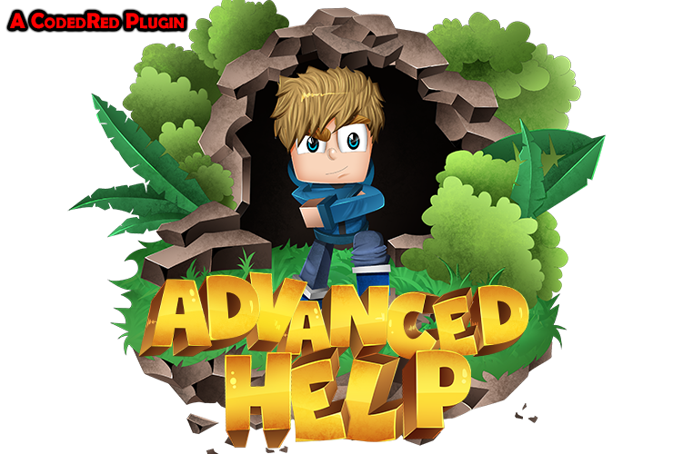

[![Contributors][contributors-shield]][contributors-url]
[![Forks][forks-shield]][forks-url]
[![Stargazers][stars-shield]][stars-url]
[![Issues][issues-shield]][issues-url]
[![GNU License][license-shield]][license-url]

<!-- PROJECT LOGO -->
 

  

  <h3 align="center">AdvancedHelp</h3>

  

    Custom /Help command, includes multiple pages, categories and GUI!
     
    <a href="https://github.com/CodedRed-Spigot/AdvancedHelp"><strong>Explore the docs »</strong></a>
     
     
    <a href="https://github.com/CodedRed-Spigot/AdvancedHelp">View Demo</a>
    ·
    <a href="https://github.com/CodedRed-Spigot/AdvancedHelp/issues">Report Bug</a>
    ·
    <a href="https://github.com/CodedRed-Spigot/AdvancedHelp/issues">Request Feature</a>
  

<!-- TABLE OF CONTENTS -->

  
<h2 style="display: inline-block">Table of Contents</h2>

  <ol>
    <li>
      <a href="#about-the-project">About The Project</a>
    </li>
<!--    <li>
      <a href="#getting-started">Getting Started</a>
      <ul>
        <li><a href="#prerequisites">Prerequisites</a></li>
        <li><a href="#installation">Installation</a></li>
      </ul>
    </li> -->
    <li><a href="#usage">Usage</a></li>
    <li><a href="#roadmap">Roadmap</a></li>
    <li><a href="#contributing">Contributing</a></li>
    <li><a href="#license">License</a></li>
    <li><a href="#contact">Contact</a></li>
  </ol>

<!-- ABOUT THE PROJECT -->
## About The Project

AdvancedHelp is a total customizable '/help' command for your server! Best Custom help page plugin out there! Help your players by showing them the ropes of the server. Create categories to further help your players out! Sick of seeing the default essentials /help? Don't want to show what plugins you have through your /help? Want to customize your server more with an awesome /help command? Download AdvancedHelp today!

<!-- GETTING STARTED
## Getting Started -->

<!-- To get a local copy up and running follow these simple steps. -->

<!-- USAGE EXAMPLES -->
## Usage

More info coming soon!
_For more examples, please refer to the [Documentation](https://www.spigotmc.org/resources/advancedhelp-custom-help-pages-with-gui.44478/)_

<!-- ROADMAP -->
## Roadmap

See the [open issues](https://github.com/CodedRed-Spigot/AdvancedHelp/issues) for a list of proposed features (and known issues).

<!-- CONTRIBUTING -->
## Contributing

Contributions are what make the open source community such an amazing place to be learn, inspire, and create. Any contributions you make are **greatly appreciated**.

1. Fork the Project
2. Create your Feature Branch (`git checkout -b feature/AwesomeFeature`)
3. Commit your Changes (`git commit -m 'Add some AwesomeFeature'`)
4. Push to the Branch (`git push origin feature/AwesomeFeature`)
5. Open a Pull Request

<!-- LICENSE -->
## License

Distributed under the GNU General Public License v3.0. See `LICENSE` for more information.

<!-- CONTACT -->
## Contact

CodedRed - [@twitter](https://twitter.com/devcodedred) - devcodedred@gmail.com

[@spigotmc](https://www.spigotmc.org/resources/authors/codedred.421005/)
Discord: CodedRed#0900

Project Link: [https://github.com/CodedRed-Spigot/AdvancedHelp](https://github.com/CodedRed-Spigot/AdvancedHelp)

<!-- MARKDOWN LINKS & IMAGES -->
<!-- https://www.markdownguide.org/basic-syntax/#reference-style-links -->
[contributors-shield]: https://img.shields.io/github/contributors/CodedRed-Spigot/AdvancedHelp.svg?style=for-the-badge
[contributors-url]: https://github.com/CodedRed-Spigot/AdvancedHelp/graphs/contributors
[forks-shield]: https://img.shields.io/github/forks/CodedRed-Spigot/AdvancedHelp.svg?style=for-the-badge
[forks-url]: https://github.com/CodedRed-Spigot/AdvancedHelp/network/members
[stars-shield]: https://img.shields.io/github/stars/CodedRed-Spigot/AdvancedHelp.svg?style=for-the-badge
[stars-url]: https://github.com/CodedRed-Spigot/AdvancedHelp/stargazers
[issues-shield]: https://img.shields.io/github/issues/CodedRed-Spigot/AdvancedHelp.svg?style=for-the-badge
[issues-url]: https://github.com/CodedRed-Spigot/AdvancedHelp/issues
[license-shield]: https://img.shields.io/github/license/CodedRed-Spigot/AdvancedHelp.svg?style=for-the-badge
[license-url]: https://github.com/CodedRed-Spigot/AdvancedHelp/blob/master/LICENSE.txt
